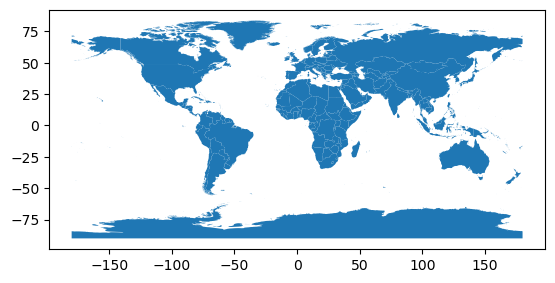
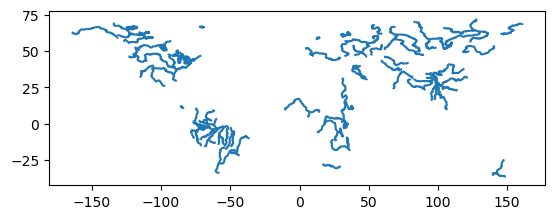
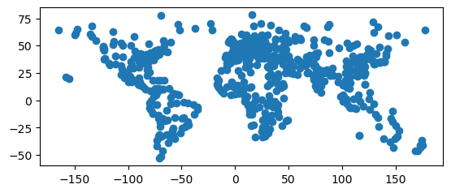
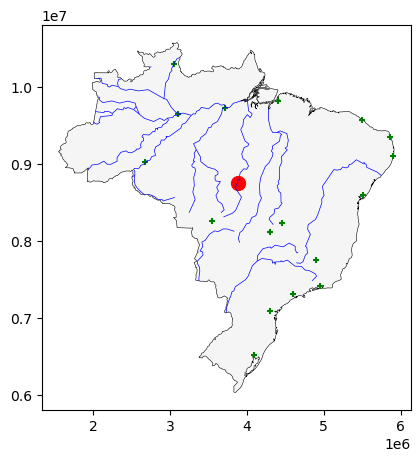

```python
%reset
# starting fresh
```

# Geometries

The geodataframe (GDF) is a dataframe (DF) where every row represents an geometry  (point, line, polygon). Python requires you to install the **GEOPANDAS** library to work with these structures (check if you have it using _pip show_).

In the repository for this class you will see a folder named **maps**, with files  I have previously downloaded from this [website](https://www.efrainmaps.es/english-version/free-downloads/world/). There are three maps: *countries*, *cities*, and *rivers* of the world.

Visit the [repository](https://github.com/PythonVersusR/DataStructures_spatial/tree/main) and you may see something like this:


When you go inside the _maps_ folder you will see this:


You see:

1.  A folder with files.
2.  Some *.json* files.
3.  Some *.zip* files. These files are zipped or compressed version of the files in the folder (not the folder with files).

Now, take a look a **World_Countries** folder:


There, you see that this **one map** requires **several files**. That is the nature of the shapefile.

Let me get the _raw_ link to each map from GitHub:


```python
linkGit_shape="https://github.com/PythonVersusR/DataStructures_spatial/raw/main/maps/World_Countries/World_Countries.shp"
linkGit_json="https://github.com/PythonVersusR/DataStructures_spatial/raw/main/maps/World_Countries.json"
linkGit_zip="https://github.com/PythonVersusR/DataStructures_spatial/raw/main/maps/World_Countries.zip"
```

Let's read the file with the help of **geopandas**:


```python
import geopandas as gpd

countriesShape=gpd.read_file(linkGit_shape)
countriesJson=gpd.read_file(linkGit_json)
countriesZip=gpd.read_file(linkGit_zip)
```

Let's see what we have:


```python
type(countriesShape),type(countriesJson),type(countriesZip)
```


    (geopandas.geodataframe.GeoDataFrame,
     geopandas.geodataframe.GeoDataFrame,
     geopandas.geodataframe.GeoDataFrame)


Some more info:


```python
countriesShape.info(),countriesJson.info(),countriesZip.info()
```

    <class 'geopandas.geodataframe.GeoDataFrame'>
    RangeIndex: 252 entries, 0 to 251
    Data columns (total 2 columns):
     #   Column    Non-Null Count  Dtype   
    ---  ------    --------------  -----   
     0   COUNTRY   252 non-null    object  
     1   geometry  252 non-null    geometry
    dtypes: geometry(1), object(1)
    memory usage: 4.1+ KB
    <class 'geopandas.geodataframe.GeoDataFrame'>
    RangeIndex: 252 entries, 0 to 251
    Data columns (total 2 columns):
     #   Column    Non-Null Count  Dtype   
    ---  ------    --------------  -----   
     0   COUNTRY   252 non-null    object  
     1   geometry  252 non-null    geometry
    dtypes: geometry(1), object(1)
    memory usage: 4.1+ KB
    <class 'geopandas.geodataframe.GeoDataFrame'>
    RangeIndex: 252 entries, 0 to 251
    Data columns (total 2 columns):
     #   Column    Non-Null Count  Dtype   
    ---  ------    --------------  -----   
     0   COUNTRY   252 non-null    object  
     1   geometry  252 non-null    geometry
    dtypes: geometry(1), object(1)
    memory usage: 4.1+ KB


    (None, None, None)


Notice all the files have a column _"geometry"_.

Let me work with the json files for all the maps we have:


```python
citiesLinkGit="https://github.com/PythonVersusR/DataStructures_spatial/raw/main/maps/World_Cities.json"
riversLinkGit="https://github.com/PythonVersusR/DataStructures_spatial/raw/main/maps/World_Hydrography.json"

citiesJson=gpd.read_file(citiesLinkGit)
riversJson=gpd.read_file(riversLinkGit)
```

We have three different maps:


```python
countriesJson.info(),citiesJson.info(),riversJson.info()
```

    <class 'geopandas.geodataframe.GeoDataFrame'>
    RangeIndex: 252 entries, 0 to 251
    Data columns (total 2 columns):
     #   Column    Non-Null Count  Dtype   
    ---  ------    --------------  -----   
     0   COUNTRY   252 non-null    object  
     1   geometry  252 non-null    geometry
    dtypes: geometry(1), object(1)
    memory usage: 4.1+ KB
    <class 'geopandas.geodataframe.GeoDataFrame'>
    RangeIndex: 610 entries, 0 to 609
    Data columns (total 4 columns):
     #   Column    Non-Null Count  Dtype   
    ---  ------    --------------  -----   
     0   NAME      610 non-null    object  
     1   COUNTRY   610 non-null    object  
     2   CAPITAL   610 non-null    object  
     3   geometry  610 non-null    geometry
    dtypes: geometry(1), object(3)
    memory usage: 19.2+ KB
    <class 'geopandas.geodataframe.GeoDataFrame'>
    RangeIndex: 98 entries, 0 to 97
    Data columns (total 3 columns):
     #   Column    Non-Null Count  Dtype   
    ---  ------    --------------  -----   
     0   NAME      98 non-null     object  
     1   SYSTEM    98 non-null     object  
     2   geometry  98 non-null     geometry
    dtypes: geometry(1), object(2)
    memory usage: 2.4+ KB


    (None, None, None)


Let's look for more details:


```python
countriesJson.head()
```


<div>
<style scoped>
    .dataframe tbody tr th:only-of-type {
        vertical-align: middle;
    }

    .dataframe tbody tr th {
        vertical-align: top;
    }

    .dataframe thead th {
        text-align: right;
    }
</style>
<table border="1" class="dataframe">
  <thead>
    <tr style="text-align: right;">
      <th></th>
      <th>COUNTRY</th>
      <th>geometry</th>
    </tr>
  </thead>
  <tbody>
    <tr>
      <th>0</th>
      <td>Aruba (Netherlands)</td>
      <td>POLYGON ((-69.88223 12.41111, -69.87486 12.415...</td>
    </tr>
    <tr>
      <th>1</th>
      <td>Antigua and Barbuda</td>
      <td>MULTIPOLYGON (((-61.73889 17.54055, -61.73195 ...</td>
    </tr>
    <tr>
      <th>2</th>
      <td>Afghanistan</td>
      <td>POLYGON ((61.27656 35.60725, 61.28791 35.55562...</td>
    </tr>
    <tr>
      <th>3</th>
      <td>Algeria</td>
      <td>POLYGON ((-2.20944 35.08583, -2.20326 35.03749...</td>
    </tr>
    <tr>
      <th>4</th>
      <td>Azerbaijan</td>
      <td>MULTIPOLYGON (((46.54037 38.87559, 46.57249 38...</td>
    </tr>
  </tbody>
</table>
</div>


```python
citiesJson.head()
```


<div>
<style scoped>
    .dataframe tbody tr th:only-of-type {
        vertical-align: middle;
    }

    .dataframe tbody tr th {
        vertical-align: top;
    }

    .dataframe thead th {
        text-align: right;
    }
</style>
<table border="1" class="dataframe">
  <thead>
    <tr style="text-align: right;">
      <th></th>
      <th>NAME</th>
      <th>COUNTRY</th>
      <th>CAPITAL</th>
      <th>geometry</th>
    </tr>
  </thead>
  <tbody>
    <tr>
      <th>0</th>
      <td>Murmansk</td>
      <td>Russia</td>
      <td>N</td>
      <td>POINT (33.08604 68.96355)</td>
    </tr>
    <tr>
      <th>1</th>
      <td>Arkhangelsk</td>
      <td>Russia</td>
      <td>N</td>
      <td>POINT (40.64616 64.52067)</td>
    </tr>
    <tr>
      <th>2</th>
      <td>Saint Petersburg</td>
      <td>Russia</td>
      <td>N</td>
      <td>POINT (30.45333 59.95189)</td>
    </tr>
    <tr>
      <th>3</th>
      <td>Magadan</td>
      <td>Russia</td>
      <td>N</td>
      <td>POINT (150.78001 59.57100)</td>
    </tr>
    <tr>
      <th>4</th>
      <td>Perm'</td>
      <td>Russia</td>
      <td>N</td>
      <td>POINT (56.23246 58.00024)</td>
    </tr>
  </tbody>
</table>
</div>


```python
riversJson.head()
```


<div>
<style scoped>
    .dataframe tbody tr th:only-of-type {
        vertical-align: middle;
    }

    .dataframe tbody tr th {
        vertical-align: top;
    }

    .dataframe thead th {
        text-align: right;
    }
</style>
<table border="1" class="dataframe">
  <thead>
    <tr style="text-align: right;">
      <th></th>
      <th>NAME</th>
      <th>SYSTEM</th>
      <th>geometry</th>
    </tr>
  </thead>
  <tbody>
    <tr>
      <th>0</th>
      <td>Aldan</td>
      <td>Lena</td>
      <td>LINESTRING (124.00678 56.47258, 123.25956 56.6...</td>
    </tr>
    <tr>
      <th>1</th>
      <td>Amazon</td>
      <td>Amazon</td>
      <td>MULTILINESTRING ((-61.27730 -3.60706, -60.6846...</td>
    </tr>
    <tr>
      <th>2</th>
      <td>Amu Darya</td>
      <td></td>
      <td>LINESTRING (73.98818 37.49952, 73.52595 37.528...</td>
    </tr>
    <tr>
      <th>3</th>
      <td>Amur</td>
      <td></td>
      <td>LINESTRING (122.63956 49.99730, 120.47874 49.2...</td>
    </tr>
    <tr>
      <th>4</th>
      <td>Angara</td>
      <td></td>
      <td>LINESTRING (105.07841 51.93053, 103.92959 51.7...</td>
    </tr>
  </tbody>
</table>
</div>


Now you see each file stores different geometries:


```python
riversJson.geom_type.value_counts()
```


    LineString         58
    MultiLineString    40
    Name: count, dtype: int64


```python
citiesJson.geom_type.value_counts()
```


    Point    610
    Name: count, dtype: int64


```python
countriesJson.geom_type.value_counts()
```


    Polygon         137
    MultiPolygon    115
    Name: count, dtype: int64


Let's see the maps:


```python
countriesJson.plot() #thickness of lines
```


    <Axes: >


    

    


```python
riversJson.plot()
```


    <Axes: >


    

    


```python
citiesJson.plot()
```


    <Axes: >


    

    


## Map Projection

The projection (CRS) is a very important property of the maps. They affect several aspects:

* shape
* area
* scale
* direction

If you plan on doing some computations with several maps, you should verify that all have the same projection (**CRS**):


```python
countriesJson.crs==citiesJson.crs==riversJson.crs
```


    True


```python
countriesJson.crs,countriesJson.crs.axis_info, countriesJson.crs.is_projected
```


    (<Geographic 2D CRS: EPSG:4326>
     Name: WGS 84
     Axis Info [ellipsoidal]:
     - Lat[north]: Geodetic latitude (degree)
     - Lon[east]: Geodetic longitude (degree)
     Area of Use:
     - name: World.
     - bounds: (-180.0, -90.0, 180.0, 90.0)
     Datum: World Geodetic System 1984 ensemble
     - Ellipsoid: WGS 84
     - Prime Meridian: Greenwich,
     [Axis(name=Geodetic latitude, abbrev=Lat, direction=north, unit_auth_code=EPSG, unit_code=9122, unit_name=degree),
      Axis(name=Geodetic longitude, abbrev=Lon, direction=east, unit_auth_code=EPSG, unit_code=9122, unit_name=degree)],
     False)


```python
citiesJson.crs,citiesJson.crs.axis_info, citiesJson.crs.is_projected
```


    (<Geographic 2D CRS: EPSG:4326>
     Name: WGS 84
     Axis Info [ellipsoidal]:
     - Lat[north]: Geodetic latitude (degree)
     - Lon[east]: Geodetic longitude (degree)
     Area of Use:
     - name: World.
     - bounds: (-180.0, -90.0, 180.0, 90.0)
     Datum: World Geodetic System 1984 ensemble
     - Ellipsoid: WGS 84
     - Prime Meridian: Greenwich,
     [Axis(name=Geodetic latitude, abbrev=Lat, direction=north, unit_auth_code=EPSG, unit_code=9122, unit_name=degree),
      Axis(name=Geodetic longitude, abbrev=Lon, direction=east, unit_auth_code=EPSG, unit_code=9122, unit_name=degree)],
     False)


```python
riversJson.crs,riversJson.crs.axis_info, riversJson.crs.is_projected
```


    (<Geographic 2D CRS: EPSG:4326>
     Name: WGS 84
     Axis Info [ellipsoidal]:
     - Lat[north]: Geodetic latitude (degree)
     - Lon[east]: Geodetic longitude (degree)
     Area of Use:
     - name: World.
     - bounds: (-180.0, -90.0, 180.0, 90.0)
     Datum: World Geodetic System 1984 ensemble
     - Ellipsoid: WGS 84
     - Prime Meridian: Greenwich,
     [Axis(name=Geodetic latitude, abbrev=Lat, direction=north, unit_auth_code=EPSG, unit_code=9122, unit_name=degree),
      Axis(name=Geodetic longitude, abbrev=Lon, direction=east, unit_auth_code=EPSG, unit_code=9122, unit_name=degree)],
     False)


Our three maps are not projected. Then some math may not work. Let's work next with one country.

## Subsetting

We want to keep the geometries of one contry. We can subset our maps by *filtering*:


```python
# filtering 
brazil=countriesJson[countriesJson.COUNTRY=='Brazil']
```

But you can also subset by *clipping*, as sometimes other data frames may not have the same fields for filtering:


```python
# clipping
citiesBrazil_clipped = gpd.clip(gdf=citiesJson,
                          mask=brazil)
riversBrazil_clipped = gpd.clip(gdf=riversJson,
                               mask=brazil)
```

Can we compute the centroid of Brazil?


```python
# this works with warning
brazil.centroid
```

    /var/folders/2n/bkfhfqq16r78g3hf7pdj56y40000gn/T/ipykernel_13845/693694584.py:2: UserWarning: Geometry is in a geographic CRS. Results from 'centroid' are likely incorrect. Use 'GeoSeries.to_crs()' to re-project geometries to a projected CRS before this operation.
    
      brazil.centroid


    29    POINT (-53.09009 -10.77302)
    dtype: geometry


We should follow the advice and set the right projection.

## Reprojecting

A projected CRS will have units in meters or feet (or similar). For a more accurate option it is better to look for the ones explicitly prepared for a particular locations of the world. You can request a crs per country [here](https://epsg.io/?q=brazil+kind%3APROJCRS):


```python
# recommended for Brazil (meters)
brazil.to_crs(5641).crs.axis_info
```


    [Axis(name=Easting, abbrev=X, direction=east, unit_auth_code=EPSG, unit_code=9001, unit_name=metre),
     Axis(name=Northing, abbrev=Y, direction=north, unit_auth_code=EPSG, unit_code=9001, unit_name=metre)]


```python
# this works with no warning

brazil.to_crs(5641).centroid
```


    29    POINT (3884486.179 8756856.093)
    dtype: geometry


Finally, we can plot what we have:


```python
# plotting:

base5641=brazil.to_crs(5641).plot(facecolor="whitesmoke", edgecolor='black', linewidth=0.4,figsize=(5,5))
brazil.to_crs(5641).centroid.plot(color='red',markersize=100,ax=base5641)
citiesBrazil_clipped.to_crs(5641).plot(marker='+', color='green', markersize=15,ax=base5641)
riversBrazil_clipped.to_crs(5641).plot(edgecolor='blue', linewidth=0.5,ax=base5641)
```


    <Axes: >


    

    

